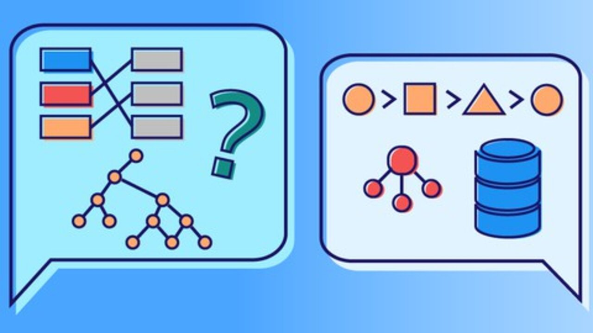

<h1>  Data Structure With Java and Sorting Algorithms </h1>

This project aims to provide a clear visualization of various
data structures and their implementations, as well as including
sorting methods. In order to interactively understand how the
following structures and algorithms work.

🚧 Finished Project 🚧

## :🔨 Functionalities
- `Functionality 1`: Stacks: Ordered list or data structure that allows storing and retrieving data, 
with the access mode to its elements being LIFO type

- `Functionality 2`: Queues: List that allows access to data from one of the two ends of the FIFO type list
  

- `Functionality 3`: Linked List: Dynamic data structure whose nodes are usually records and which have a fixed size
  

- `Functionality 4`: Trees: Non-linear data structures that serve to represent hierarchical information structures and addresses or labels in an organized manner
  

- `Functionality 5`: Graphs: Abstract data types, A graph is a non-empty set of objects or physical entities that have a relationship between them.
  

- `Functionality 6`: Sorting: Set of instructions that take an array or list as input and arrange the elements in a particular order
  

## 📁 Project access
* Clone the repository
  git clone https://github.com/zohan22/DataStructure.git
* Navigate to the Project Directory
  cd your-repository
* Compile and Run the Project
  Run the project from the Main class.
* Interact with the Console Interface
  Follow the instructions provided by the console interface to select and use different functionalities of the project
  

## Note:
Type of Data we are working with:
* Linked list: Person Object 
* Double Linked List: Integers
* Circular Linked List: Integers
* Array Stack: Character
* Linked List Stack: Integers
* Array Queue: Integer
* Linked List Queue: Integer
* Dequeue: Integer
* Tree: Integer
* Graph: Integer

## ✔ Used technology
* Java
* Maven
## Projects
* Towers of Hanoi: https://github.com/zohan22/Hanoi
* Family tree and relationships: https://github.com/brayan146/FamilyTree

